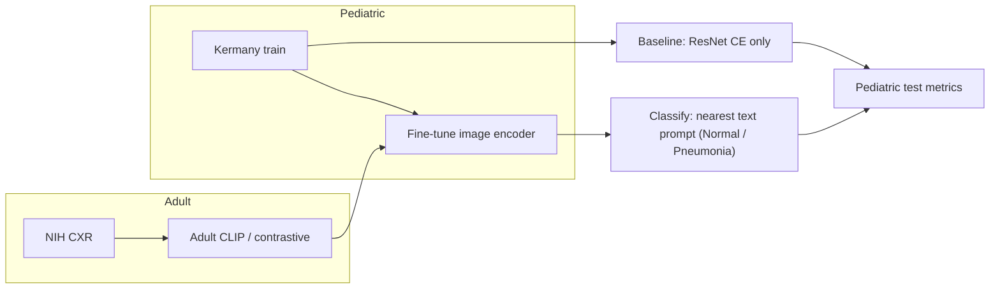
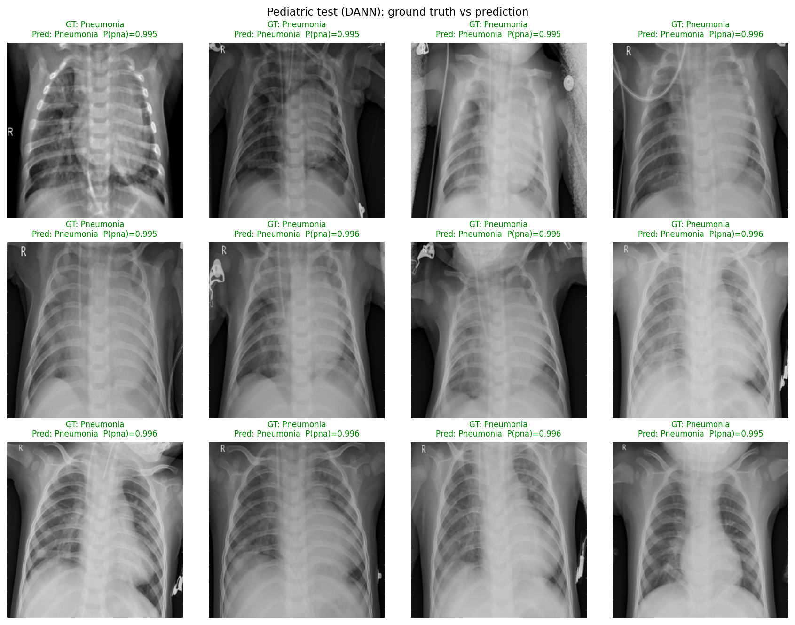

# Pediatric chest X-ray domain adaptation

CLIP-style **image + text** models trained on **adult NIH** CXR, then **fine-tuned** on a **pediatric** pneumonia vs. normal task—compared to a **pediatric-only ResNet** baseline. We additionally explore alternative strategies like **DANN** and **OT**.

---

## Setup

| File                     | Role                                         |
| ------------------------ | -------------------------------------------- |
| `adult_manifest.csv`     | NIH train/val image paths + labels           |
| `pediatric_manifest.csv` | Pediatric train/val/test                     |
| `bert_prompt_tokens.pt`  | Frozen BERT prompt tokens for the text tower |

---

## What to run (main results)

| Goal                                                                      | Command                              |
| ------------------------------------------------------------------------- | ------------------------------------ |
| **Learning curve** (proposed vs baseline, AUC / F1 vs pediatric fraction) | `python run_learning_curve.py`       |
|                                                                           | `sbatch slurm_run_learning_curve.sh` |
| **DANN** (domain-adversarial fine-tune + eval figures)                    | `python run_dann_viz.py`             |
|                                                                           | `sbatch slurm_run_dann.sh`           |
| **OT-Wasserstein(SWD)**                                                   | `python run_ot_learning_curve.py`    |
|                                                                           | `sbatch slurm_run_ot.sh`             |

**Useful flags:** `--image-backbone resnet50` (proposed), `--baseline-backbone resnet50` (supervised baseline), `--pediatric-seeds 42 43 44` (error bars in plots).

---

## Project map

| Module / script      | Purpose                                                    |
| -------------------- | ---------------------------------------------------------- |
| `cxr_model.py`       | `ImageTextModel`, `clip_style_loss`                        |
| `cxr_engine.py`      | Training, eval, t-SNE helpers, `learning_curve_experiment` |
| `cxr_dann.py`        | DANN fine-tune (`finetune_pediatric_clip_dann`)            |
| `cxr_eval_viz.py`    | ROC, PR, confusion, calibration, Grad-CAM hooks, etc.      |
| `preprocess_data.py` | Build manifests + prompt tensors                           |

---

## Citations

- CLIP: Radford et al., ICML 2021  
- CheXzero-style CXR + text: Tiu et al., *Nat. Biomed. Eng.* 2022  
- DANN: Ganin et al., arXiv:1505.07818
