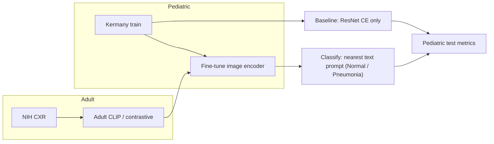
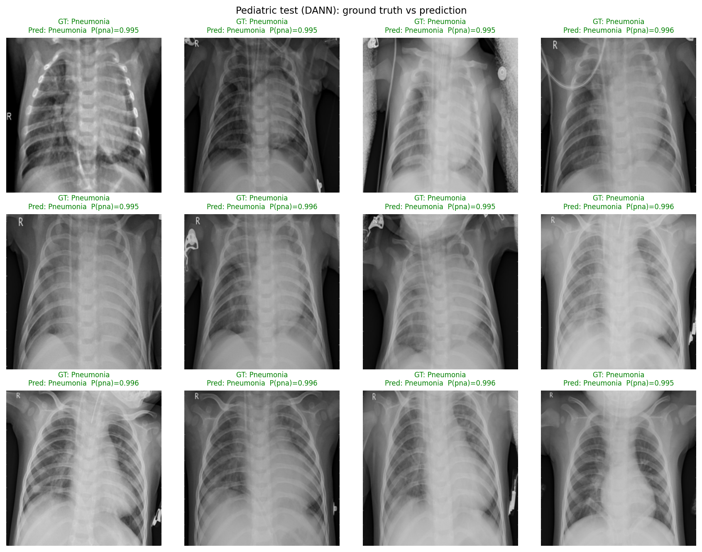

# Pediatric chest X-ray domain adaptation

CLIP-style **image + text** models trained on **adult NIH** CXR, then **fine-tuned** on a **pediatric** pneumonia vs. normal task—compared to a **pediatric-only ResNet** baseline. We additionally explore alternative strategies like **DANN** and **OT**.

```mermaid
flowchart LR
  subgraph Adult
    NIH[NIH CXR] --> ACLIP[Adult CLIP / contrastive]
  end
  subgraph Pediatric
    Kermany[Kermany train] --> FT[Fine-tune image encoder]
  end
  ACLIP --> FT
  FT --> Cls["Classify: nearest text prompt (Normal / Pneumonia)"]
  Kermany --> ResNet[Baseline: ResNet CE only]
  ResNet --> Test[Pediatric test metrics]
  Cls --> Test
```

---

## Setup

| File                     | Role                                         |
| ------------------------ | -------------------------------------------- |
| `adult_manifest.csv`     | NIH train/val image paths + labels           |
| `pediatric_manifest.csv` | Pediatric train/val/test                     |
| `bert_prompt_tokens.pt`  | Frozen BERT prompt tokens for the text tower |

---

## What to run (main results)

| Goal                                                                      | Command                              |
| ------------------------------------------------------------------------- | ------------------------------------ |
| **Learning curve** (proposed vs baseline, AUC / F1 vs pediatric fraction) | `python run_learning_curve.py`       |
|                                                                           | `sbatch slurm_run_learning_curve.sh` |
| **DANN** (domain-adversarial fine-tune + eval figures)                    | `python run_dann_viz.py`             |
|                                                                           | `sbatch slurm_run_dann.sh`           |
| **OT-Wasserstein(SWD)**                                                   | `python run_ot_learning_curve.py`    |
|                                                                           | `sbatch slurm_run_ot.sh`             |

**Useful flags:** `--image-backbone resnet50` (proposed), `--baseline-backbone resnet50` (supervised baseline), `--pediatric-seeds 42 43 44` (error bars in plots).

---

## Project map

| Module / script      | Purpose                                                    |
| -------------------- | ---------------------------------------------------------- |
| `cxr_model.py`       | `ImageTextModel`, `clip_style_loss`                        |
| `cxr_engine.py`      | Training, eval, t-SNE helpers, `learning_curve_experiment` |
| `cxr_dann.py`        | DANN fine-tune (`finetune_pediatric_clip_dann`)            |
| `cxr_eval_viz.py`    | ROC, PR, confusion, calibration, Grad-CAM hooks, etc.      |
| `preprocess_data.py` | Build manifests + prompt tensors                           |

---

# Results

Method	AUC-ROC	F1 (0.5)	Sensitivity	Specificity
Baseline (pediatric-only, ResNet-50)	0.8745	0.8090	–	–
Text-anchor (ResNet-50)	0.9394	0.8224	0.997	0.286
DANN	0.9242	0.8600	0.997	0.462
OT (Wasserstein)	0.9508	0.8571	1.0000	0.444

Adult contrastive pretraining beats the pediatric-only baseline across the board, and the gap is largest when pediatric fine-tuning data is scarce, so the pretrained text anchors are doing real work as an initialization, not just adding parameters. Encoder capacity matters as much as the pretraining scheme: ResNet-18 underperforms the baseline despite the same adult pretraining, while ResNet-50 clears it by a wide margin, so representational capacity is a precondition for transfer, not a detail.

Across alignment strategies, no single method dominates on every axis. Text-anchoring gives the cleanest semantic separation (see the t-SNE plots) and the simplest inference path (nearest-prompt lookup, no extra classifier). DANN and OT both push specificity higher than text-anchoring at the default threshold, with OT edging out AUC-ROC overall, suggesting distributional alignment captures a slightly different piece of the domain shift than semantic grounding does. In practice this points to combining objectives (e.g., text-anchored loss plus a distribution-matching term) rather than treating them as competitors, and to picking the alignment strategy based on deployment priorities: sensitivity-critical screening favors the text-anchor or OT operating points, while settings where false positives are costly favor DANN's more balanced boundary.

---

## Citations

- CLIP: Radford et al., ICML 2021  
- CheXzero-style CXR + text: Tiu et al., *Nat. Biomed. Eng.* 2022  
- DANN: Ganin et al., arXiv:1505.07818
